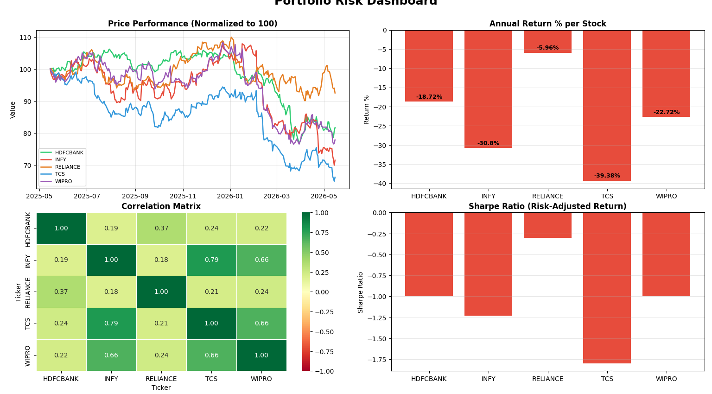

# Portfolio Risk Model

A Python-based portfolio risk analysis tool using live NSE stock data.

## What it does
- Pulls live stock data from NSE using yfinance
- Calculates Annual Return, Volatility, Sharpe Ratio, Max Drawdown
- Generates a 4-chart visual dashboard
- Correlation matrix to find diversification opportunities

## Stocks Analyzed
RELIANCE, TCS, INFY, HDFCBANK, WIPRO

## Tools Used
- Python
- yfinance
- pandas
- numpy
- matplotlib
- seaborn

## Dashboard Preview
# portfolio-risk-model
